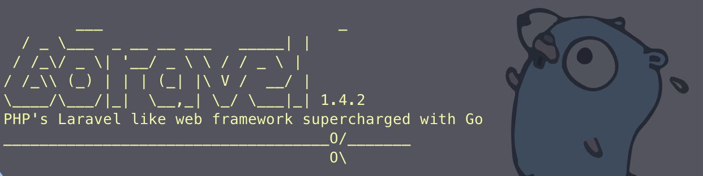
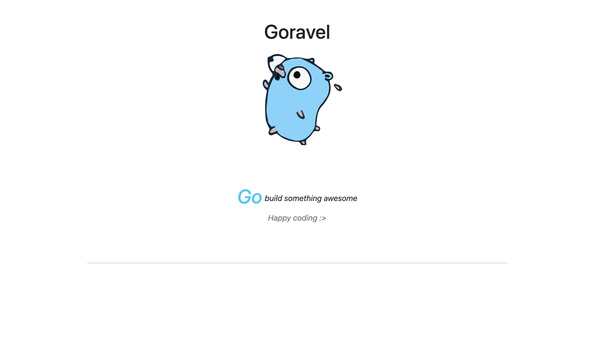

# Goravel

PHP's Laravel like web framework supercharged with Go.


## Features overview

- Routing
- Handlers (For Laravel's Controllers)
- Build robust and scalable RESTful APIs
- Middlewares
- Data binding for JSON, XML and form payloads
- Handy functions to send variety of HTTP responses
- Template rendering with Go's html/template package or Jet template engine
- Multiple database support (PostgreSQL, MySQL, Mariadb), just provide the driver and connection string, Goravel will handle the rest
- Migrations handled out of the box for the user
- Caching support (Redis and BadgerDB)
- Session management built-in
- In-built user authentication, you don't have to reinvent the wheel
- In-built password reset functionality
- Remember me functionality using cookies
- Validation support with Goravel's Validator
- Upper/db ORM support
- Email sending support with Goravel's Mailer
- Scheduled tasks support (Cron jobs)
- Helper functions for encryption
- Goravel Command Line Tool to make your life easier with Goravel


## Why Goravel?

- Goravel is a opinionated web framework that is inspired by Laravel, a popular PHP web framework. It's a heavy duty web framework unlike other micro web frameworks in Go like Gin, Echo, Fiber etc. Goravel is designed to help you build robust and scalable web applications with ease. It's a full stack web framework that comes with a lot of features out of the box so that you can focus on building your application rather than reinventing the wheel.

- Goravel is built on top of Go's standard library and some popular third party packages loved by the Go community:

    - [Chi Router](https://github.com/go-chi/chi) for routing
    - [Upper/db ORM](https://upper.io/v4/) for database operations
    - [Jet template engine](https://github.com/CloudyKit/jet)
    - [alexedwards/scs](https://github.com/alexedwards/scs) for session management
    - [golang-migrate](https://github.com/golang-migrate/migrate) for migrations


- So you don't have to learn anything new to get started with Goravel. It's a collection of some of the best Go packages that are already popular in the Go community. Goravel just wraps them up in a nice package so that you can build your web applications with ease without you having to set up everything from scratch.

## Installation

1. Install Goravel CLI tool:

```bash
go install github.com/saalikmubeen/goravel/cmd/goravel@latest
```

2. Make sure to add `$GOPATH/bin` to your `$PATH` so that you can run the Goravel CLI tool from anywhere. If you don't have it, you can add it to your `~/.bashrc` or `~/.bash_profile` or `~/.zshrc` file:

```bash
export GOPATH="$HOME/go"
export PATH=$PATH:$GOPATH/bin
```

3. Create a new Goravel project:

```bash
goravel new myapp
```

4. Change directory to your project:

```bash
cd myapp
```

5. Install the dependencies (just in case):

```bash
go mod tidy
```

6. Run the server:

```bash
goravel serve
```
`OR`

```bash
go run ./*.go
```

7. Visit `http://localhost:4000` in your browser to see the welcome page.




## Example Usage

Check out the [Goravel Demo App](https://github.com/saalikmubeen/goravel-demo-app) to see how to use Goravel to build an application with user authentication, cache management, sending JSON and XML responses, email sending, password reset, remember me functionality using cookies, API routes, and much more.
It will help you to get started with Goravel quickly.


## Goravel Command Line Tool

Goravel comes with a command line tool that makes your life easier with Goravel. You can use the Goravel CLI tool to create a new Goravel project, generate handlers, models, migrations, run migrations, start the server, and much more.

Here are some of the commands that you can use with the Goravel CLI tool:


- `goravel help`: Shows the help message

- `goravel version`: Shows the version of Goravel CLI tool

- `goravel serve`: Start the web server

- `goravel new <project-name>`: Create a new Goravel project

- `goravel make handler <handler-name>`: Generates a new handler

- `goravel make model <model-name>`: Generates a new model

- `goravel make migration <migration-name>`: Generates two migration files for up and down operations

- `goravel migrate up`: Run all the pending migrations

- `goravel migrate down`: Rollback the last migration

- `goravel migrate down all`: Rollback all the migrations

- `goravel migrate fix`: Fix the migrations table if it's corrupted

- `goravel migrate to <version_number>`: Migrate to a specific version (version_number is +ve for up and -ve for down migration)

- `goravel migrate reset`: Resets the database. This first runs all the down migrations in reverse order and then runs all the up migrations.

- `goravel make auth`: Generates all the necessary files for user authentication. This creates and runs migrations for authentication tables, and creates models and middleware. It also creates handlers for authentication, password reset, and remember me functionality. Yiiiihaaa!
You don't have to do anything. Just run this command and you are good to go.

- `goravel make session`: Generates all the necessary files for session management if you want to use database for session storage. This creates and runs migrations for session tables, again saving you from the hassle of writing boring migration files.


